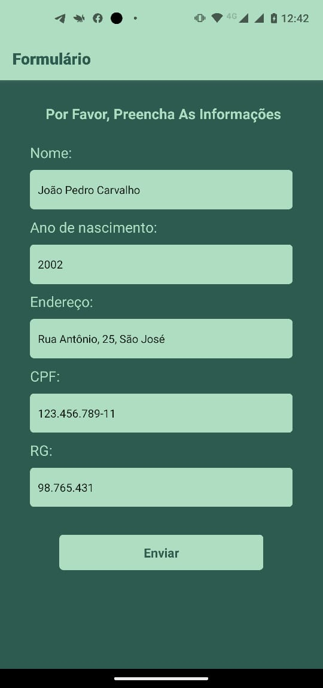
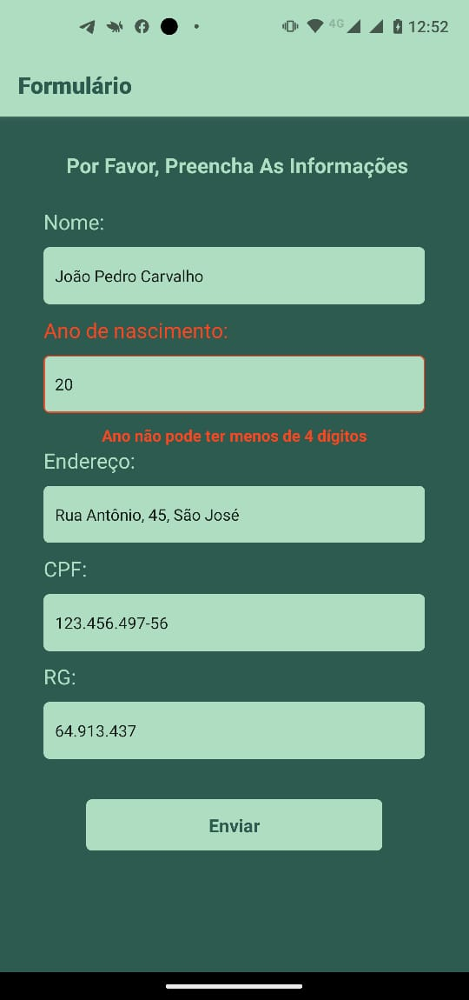
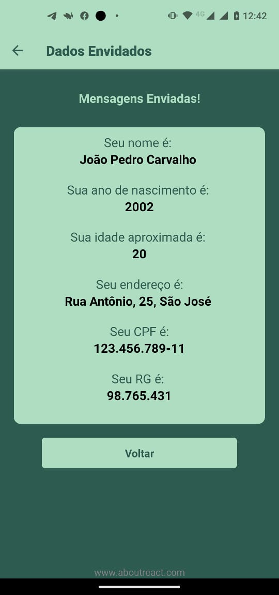

<h1 align="center">
    Formulário simples em React Native
</h1>

<div align="center">
   <a href="https://github.com/JohnPetros">
      
   </a>
   
   <a href="https://github.com/JohnPetros/form-validation/commits/main">
      
   </a>
  </a>
   </a>
   <a href="https://github.com/JohnPetros/form-validation/blob/main/LICENSE.md">
      
   </a>
    
</div>

<br>

<p align="center">
  <a href="#-projeto">Projeto</a>&nbsp;&nbsp;&nbsp;|&nbsp;&nbsp;&nbsp;
  <a href="#-funcionalidades">Funcionalidades</a>&nbsp;&nbsp;&nbsp;|&nbsp;&nbsp;&nbsp;
  <a href="#-aprendizado">Aprendizado</a>&nbsp;&nbsp;&nbsp;|&nbsp;&nbsp;&nbsp;
  <a href="#-tecnologias">Tecnologias</a>&nbsp;&nbsp;&nbsp;|&nbsp;&nbsp;&nbsp;
  <a href="#-instalação-e-execução">Instalação e execução</a>&nbsp;&nbsp;&nbsp;|&nbsp;&nbsp;&nbsp;
  <a href="#-licença">Licença</a>
</p>

## 🖥️ Projeto

Formulário com validação que recebe dados de um usuário (nome, ano de nascimento, endereço, CPF e RG. Após o formulário ser submitado, o usuário é redirecionado para a segunda tela do aplicativo, mostrando seus dados inseridos em formato de tabela, juntamento com sua idade, calculada a partir do ano de nascimento fornecido. Segundo projeto desenvolvido como tarefa para matéria de Programação Mobile na Etec

### Demonstração
<div align="center">
    
    
    
</div>
<hr>

## ✨ Funcionalidades

- Validação de dados de formulário
- Mensagens de erro
- Cáculo da idade do usuário com base no ano de nascimento do usuário
- listagem de dados cadastrados com sucesso

<hr>

## 📖 Aprendizado

-Construção de formulários em React
-Uso de states para alterar componentes dinamicamente
-Validação de dados com REGEX (expressões regulares)
-Passagem de dados entre telas por meio de parâmetros de rota
-Fluxo de renderização
-Mensagens de alerta
-Renderização e estilização condicional
-Experiência de usuário no que diz respeito a preencher formulários em dispositivos móveis

<hr>

## 🚀 Tecnologias

Esse projeto foi desenvolvido com as seguintes tecnologias:

#### **Mobile** ([React Native](http://www.reactnative.com/))

- **[Expo](https://expo.io/)**
- **[React Navigation](https://reactnavigation.org/)**

## Instalação e execução

### Pré-requesitos

Antes de baixar o projeto você vai precisar ter instalado na sua máquina as seguintes ferramentas:

- [Git](https://git-scm.com)
- [NodeJS](https://nodejs.org/en/)
- [Yarn](https://yarnpkg.com/) ou [NPM](https://www.npmjs.com/)

Além disto é bom ter um editor para trabalhar com o código como [VSCode](https://code.visualstudio.com/)<br>4

> Você poder executar o App no seu celular ou em um emulador de celular da sua preferência usando Expo acessando este link: [expo.dev](hhttps://snack.expo.dev/@joaopcarvalho/github.com-johnpetros-form-validation?platform=android).

#### 📟 Rodando o Mobile

```bash
# Clone este repositório
$ git clone  https://github.com/JohnPetros/form-validation.git

# Acesse a pasta do projeto no terminal/cmd
$ cd form-validation

# Instale as dependências
$ npm install

# Execute a aplicação em modo de desenvolvimento
$ npx expo start

```
---

## :memo: Licença

Esse projeto está sob a licença MIT. Veja o arquivo [LICENSE](LICENSE) para mais detalhes.

---

Feito com 💜 by João Pedro 👋🏻
